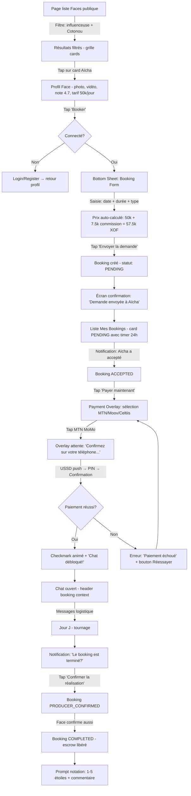
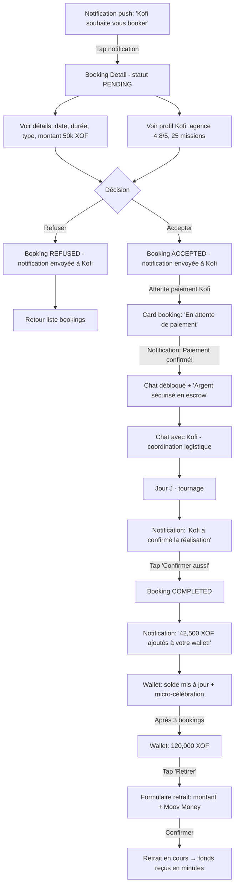
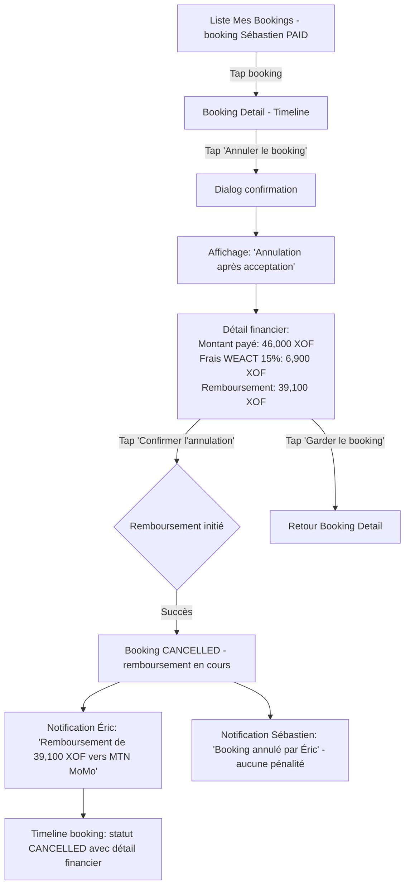

# UX Design Specification WEACT - Direct Booking & Payment

**Author:** Lamakira
**Date:** 2026-02-28

---

<!-- UX design content will be appended sequentially through collaborative workflow steps -->

## Executive Summary

### Project Vision

WEACT Direct Booking & Payment provides a streamlined channel for Producers to reserve Faces directly, bypassing the multi-step Mission workflow. The UX must make a complex financial flow (booking → escrow → chat → confirmation → payout) feel effortless on mobile, while building trust through transparency at every step.

### Target Users

**Producer (Primary):** Agencies and individuals who know which Face they want. Mobile-dominant, variable tech savviness, urgency-driven. Needs: speed, simplicity, clear pricing, reliable payment.

**Face (Primary):** Talent (actors, influencers, models) receiving booking requests. Mobile-dominant, notification-driven. Needs: clear booking details, Producer reputation visibility, secure payment, easy wallet management.

**Admin (Secondary, V2):** Dispute resolution only — not in MVP UX scope.

### Key Design Challenges

1. **Mobile-first on African 4G** — <400px screens, <2s load, 44px touch targets, Chrome Android priority
2. **Financial trust building** — Escrow is a new concept locally; every screen must communicate security
3. **Multi-step flow simplicity** — 7-step booking lifecycle must feel lightweight with visible progress
4. **Dual-role navigation** — Same app adapts for Producer (booking/paying) and Face (receiving/earning)
5. **Payment redirect handling** — Fedapay Mobile Money flow with graceful pending/success/failure states
6. **Purpose-driven chat** — Logistics coordination tool, not social messaging

### Design Opportunities

1. **Status timeline** — Visual booking lifecycle stepper that makes escrow tangible and builds trust
2. **One-tap rebooking** — Pre-filled form for repeat Producers (core retention loop)
3. **Wallet as motivation** — Earnings growth visualization drives Face engagement
4. **Smart notification content** — Actionable notifications that drive faster response and higher acceptance

## Core User Experience

### Defining Experience

**Producer core action:** Book a Face in under 3 minutes — profile discovery to payment sent.
**Face core action:** Receive a paid booking without effort — notification arrives, details clear, money secured.

The product wins when booking a Face on WEACT is faster and simpler than contacting them via WhatsApp.

### Platform Strategy

- Web SPA (Vue 3), mobile-first responsive design
- Primary: touch input on Chrome Android (Benin market)
- Secondary: mouse/keyboard on desktop (agency Producers)
- Breakpoints: sm(640px), md(768px), lg(1024px) — Tailwind 4.1
- No offline mode needed — all actions require server connectivity
- No native app for MVP — PWA possible in V2

### Effortless Interactions

**Zero-thought actions:**
1. Price auto-calculates when Producer selects date + duration (commission breakdown visible)
2. Payment = one tap → Mobile Money redirect → confirm on phone → done
3. Chat unlocks automatically after payment confirmation
4. 72h auto-completion protects Face from Producer inaction
5. Wallet withdrawal = select amount → choose Mobile Money → confirm

**Automatic behaviors:**
- Commission calculation and display at booking creation
- Escrow lock/release on state transitions
- Notifications at each lifecycle stage
- Rating prompt after completion
- Real-time status updates via WebSocket

### Critical Success Moments

1. **"Booker" button on profile** (Producer) — "I can act NOW" — the discovery moment
2. **Booking notification** (Face) — "Someone wants ME" — the emotional hook
3. **Chat unlocks** (Producer) — "It's real, we're coordinating" — the confirmation moment
4. **Money in wallet** (Face) — "I got paid, the platform works" — the trust moment
5. **One-minute rebooking** (Producer) — "Faster than WhatsApp" — the retention moment

**Make-or-break flows:** Payment redirect (Fedapay), booking acceptance speed, wallet withdrawal reliability.

### Experience Principles

1. **Speed over features** — Every action feels instant. Profile to payment in under 3 minutes.
2. **Trust through transparency** — Show booking status always. Show money flow visibly (amount → escrow → wallet).
3. **Mobile-native, not mobile-adapted** — Thumb zones, 360px width, 4G latency. Desktop is bonus.
4. **Role-aware simplicity** — App adapts to Producer or Face. No cognitive overhead.
5. **Celebrate the money moments** — Payment confirmed, wallet credited, withdrawal received = micro-celebrations.

## Desired Emotional Response

### Primary Emotional Goals

**Producer:** Empowered & Efficient — "I found the right Face, booked instantly, and everything is handled."
**Face:** Valued & Secure — "Someone chose ME, the money is guaranteed, and I control my earnings."

### Emotional Journey Mapping

| Stage | Producer Emotion | Face Emotion | Design Implication |
|-------|-----------------|-------------|-------------------|
| 1. Discovery | Curiosity → Confidence | — | Profile must convey trust instantly (ratings, photo, tarif visible) |
| 2. Booking Form | Control → Anticipation | — | Auto-calculated pricing removes doubt; clear commission breakdown |
| 3. Waiting for Response | Anxiety → Hope | Surprise → Flattery | Producer: show "pending" with estimated response time. Face: rich notification with Producer info |
| 4. Acceptance | Relief → Excitement | Validation → Commitment | Both: celebratory status change. Chat unlock teaser |
| 5. Payment | Determination → Trust | Anticipation → Security | Producer: clear escrow explanation. Face: "Money secured" confirmation |
| 6. Chat | Collaboration → Alignment | Professionalism → Connection | Purpose-driven chat with booking context pinned at top |
| 7. Mission Day | Focus → Engagement | Readiness → Performance | Minimal UX interference — booking details accessible but not intrusive |
| 8. Confirmation | Satisfaction → Closure | Accomplishment → Relief | Double-confirm flow feels like a handshake, not bureaucracy |
| 9. Rating | Reflection → Generosity | Anticipation → Validation | Prompt is gentle, not demanding. Stars + optional comment |
| 10. Payout | — | Triumph → Trust | Wallet credit with micro-celebration. Running total visible |
| 11. Withdrawal | — | Control → Satisfaction | Simple flow: amount → Mobile Money → done. Real money in phone |
| 12. Rebooking | Nostalgia → Efficiency | Pride → Loyalty | Pre-filled form. "Rebook [Face Name]" one-tap |

### Micro-Emotions to Nurture

**Confidence** — At every decision point, the user knows what happens next and what it costs.
**Trust** — Money flow is always visible. Escrow is explained, not hidden. Status is always current.
**Accomplishment** — Completing each step feels like progress. Stepper visualization reinforces forward motion.

### Micro-Emotions to Prevent

**Anxiety** — Payment redirects must feel safe. Loading states must be informative, not empty.
**Abandonment** — Waiting for Face response or payment confirmation must never feel like a dead-end.
**Betrayal** — If anything fails (payment, cancellation), the user must understand WHY and WHAT happens to their money.

### Design Implications

| Emotion to Nurture | UX Approach |
|--------------------|-------------|
| Confidence | Progressive disclosure — show next step preview before user commits |
| Trust | Money flow visualization — amount → escrow → wallet with status at each node |
| Accomplishment | Stepper component with checkmarks + subtle animation on completion |
| Speed | Skeleton screens, optimistic UI updates, pre-calculated pricing |
| Security | Lock icons near payment info, "Secured by WEACT" badges, escrow explainers |
| Validation (Face) | Rich booking notification with Producer photo, project details, guaranteed amount |
| Control (Face) | Wallet dashboard with earnings graph, withdrawal history, pending amounts |

| Negative Emotion | Prevention Approach |
|------------------|---------------------|
| Anxiety | Never show empty loading. Always show what's happening: "Redirecting to MTN MoMo...", "Waiting for Face response..." |
| Abandonment | Timeout indicators: "Face typically responds within 2h". Auto-expire after 24h with clear refund message |
| Betrayal | Cancellation screens ALWAYS show money status first: "Your 75,000 XOF will be refunded within 24h" |
| Confusion | Every status has a plain-language explanation: "En attente de paiement" + "Le producteur doit payer pour débloquer le chat" |
| Frustration | Error states include next action: "Payment failed → Try again / Choose another method / Contact support" |

### Emotional Design Principles

1. **Show, don't hide, the money** — Every screen involving payments shows the exact amount and where it is (your account → escrow → Face's wallet).
2. **Acknowledge every transition** — Status changes get visual feedback: toast notification + stepper update + sound/haptic on mobile.
3. **Design for the anxious moment** — Payment redirect, waiting for acceptance, and withdrawal are stress points. Over-communicate status during these.
4. **Celebrate completions, not just starts** — Booking confirmed, mission completed, and money received are celebration moments. Use subtle animations and positive language.
5. **Humanize the other party** — Always show the other person's photo and name. "Awa has accepted your booking" > "Booking #1234 accepted".

## UX Pattern Analysis & Inspiration

### Inspiring Products Analysis

#### Instagram — Design Visuel & Découverte

**Problème résolu :** Découvrir et suivre la vie de ses personnalités préférées et ami.e.s à travers le visuel.

**Ce qui fonctionne :**
- **Profil visuel immédiat** — Photo + bio + grille de contenu. En 2 secondes, on sait qui est la personne. Directement transférable au profil Face (photo, spécialités, note, tarif).
- **Card-based discovery** — Feed de cards visuelles avec photo dominante. Le regard est guidé vers la personne, pas le texte.
- **Actions contextuelles** — Boutons d'action ("Follow", "Message") toujours visibles sur le profil, dans la thumb zone. Pattern direct pour le bouton "Booker".
- **Stories comme statut** — L'anneau coloré autour de la photo signale de la nouveauté. Transférable aux Faces disponibles vs indisponibles.
- **Micro-interactions de validation** — Cœur animé au double-tap, confirmation visuelle immédiate de chaque action.

#### TikTok — Interactions & Scroll Infini

**Problème résolu :** Divertir via un scroll infini de vidéos courtes — engagement maximal avec effort minimal.

**Ce qui fonctionne :**
- **Full-screen immersion** — Un seul contenu à la fois, aucune distraction. L'attention est captée immédiatement.
- **Zero-decision browsing** — Pas besoin de choisir quoi regarder. Le contenu vient à toi. Pattern transférable à la découverte de Faces (profils suggérés).
- **Interactions gestuelles** — Swipe up = suivant. La gestuelle remplace les boutons. Mobile-native par excellence.
- **Feedback immédiat** — Chaque action (like, share, follow) a une réponse visuelle instantanée. Aucune latence perçue.
- **Simplicité de la boucle** — Consommer → réagir → consommer. Aucune friction dans le cycle.

#### Snapchat — Chat Contextualisé

**Problème résolu :** Discuter avec ses potes de manière légère et éphémère.

**Ce qui fonctionne :**
- **Chat direct sans bruit** — Conversation 1:1, pas de groupes massifs. Aligné avec le chat booking Producer ↔ Face.
- **Contexte persistant** — Le profil de l'ami est toujours accessible depuis le chat. Pattern transférable : booking details toujours accessibles depuis le chat.
- **Indicateurs de présence** — On sait quand l'autre est actif. Utile pour le chat booking (Face en ligne = réponse rapide).
- **Actions rapides** — Envoyer une photo, un snap, un message = gestes simples. Le chat est un outil, pas un monde.

#### Portail National des E-Services du Bénin — Paiement Mobile Money

**Problème résolu :** Permettre aux citoyens béninois de payer des services publics en ligne via Mobile Money (MTN MoMo, Moov, Celtiis).

**Ce qui fonctionne :**
- **USSD push model** — L'utilisateur reste sur la page web. Le prompt de paiement arrive directement sur son téléphone via USSD. Pas de redirection navigateur. Pattern critique pour WEACT.
- **Multi-provider** — MTN MoMo, Moov Money, Celtiis Cash couverts. Même logique pour Fedapay.
- **Formulaire → paiement → confirmation** — Flow linéaire en étapes claires, compréhensible même avec une faible tech-savviness.
- **24/7 availability** — Pas de contrainte d'horaire. Le digital comme libération de la contrainte physique.

**Ce qui pourrait être amélioré :**
- État d'attente du USSD push mal communiqué — si le téléphone est éteint ou hors réseau, l'UX casse sans fallback.
- Pas de feedback temps-réel pendant l'attente de confirmation.
- Étapes multiples avec uploads de documents sur réseau lent = frustration.

### Transferable UX Patterns

**Navigation Patterns :**
- **Profil = carte de visite visuelle** (Instagram) → Profil Face avec photo, spécialités, tarif, note visible en 2 secondes
- **Actions dans la thumb zone** (Instagram/TikTok) → Bouton "Booker" en bas de l'écran, toujours accessible
- **Un contenu à la fois** (TikTok) → Booking detail en full-screen mobile, pas de sidebar ni distractions

**Interaction Patterns :**
- **Feedback immédiat sur chaque action** (TikTok/Instagram) → Toast + animation sur chaque transition de statut booking
- **Gestes natifs mobile** (TikTok) → Swipe pour naviguer entre bookings, pull-to-refresh pour statut
- **Chat contextuel** (Snapchat) → Chat booking avec détails épinglés en haut, profil accessible en un tap

**Payment Patterns :**
- **USSD push + polling** (E-Services Bénin) → "En attente de confirmation MTN MoMo..." avec spinner informatif et timer
- **Sélection provider claire** (E-Services Bénin) → Logos MTN/Moov/Celtiis comme boutons radio visuels, pas de dropdown
- **Confirmation multi-canal** (E-Services Bénin) → Confirmation sur le téléphone + confirmation sur la page web

**Visual Patterns :**
- **Photo dominante dans les cards** (Instagram) → Cards booking avec photo de la Face en premier, détails en second
- **Micro-animations de validation** (Instagram/TikTok) → Checkmark animé quand booking accepté, confetti subtil quand argent reçu
- **Indicateur de statut visuel** (Instagram Stories ring) → Anneau de couleur autour de la photo Face selon disponibilité

### Anti-Patterns to Avoid

- **Pages de chargement vides** — TikTok ne montre jamais un écran blanc. Utiliser des skeleton screens partout.
- **Redirections navigateur pour le paiement** — Le Portail Bénin garde l'utilisateur sur page. Ne jamais ouvrir un nouvel onglet pour payer.
- **Chat surchargé** — Snapchat est léger. Le chat booking ne doit PAS devenir WhatsApp (pas de groupes, pas de statuts, pas de stories).
- **Formulaires longs sur mobile** — Instagram a optimisé l'inscription en 3 étapes. Le booking form doit avoir max 4-5 champs visibles.
- **Attente sans feedback** — Le pire pattern du Portail Bénin : USSD push envoyé mais aucune indication de progrès. Toujours montrer un timer + message explicatif.
- **Upload de fichiers sur 4G** — Pas d'upload dans le booking flow MVP. Si nécessaire plus tard, compresser côté client.
- **Menus hamburger cachés** — TikTok/Instagram utilisent des barres de navigation fixes en bas. Pas de menus cachés pour les actions principales.

### Design Inspiration Strategy

**What to Adopt (copier directement) :**
- **Photo-first profile cards** (Instagram) → Le profil Face EST sa carte de visite. Photo en héros, info secondaire en dessous.
- **Bottom navigation bar** (Instagram/TikTok) → Barre fixe en bas : Accueil, Bookings, Chat, Wallet, Profil.
- **Instant feedback** (TikTok) → Chaque tap produit une réponse visuelle en <200ms. Optimistic UI updates.
- **USSD push + in-page waiting** (E-Services Bénin) → Garder l'utilisateur sur la page WEACT pendant le paiement Mobile Money.

**What to Adapt (modifier pour WEACT) :**
- **Discovery feed** (TikTok/Instagram) → Pas de scroll infini, mais une grille de Faces filtrables avec cards visuelles. Booking ≠ entertainment.
- **Chat éphémère** (Snapchat) → Chat persistant mais purpose-driven. Messages restent, mais le chat est un outil de coordination, pas un réseau social.
- **Stepper flow** (E-Services Bénin) → Adapter le flow multi-étapes en stepper visuel pour le lifecycle booking (7 étapes), mais plus visuel et mobile-friendly que le portail gouvernemental.

**What to Avoid (ne pas importer) :**
- **Infinite scroll** (TikTok) → Le booking n'est pas du divertissement. Discovery limitée, action rapide.
- **Algorithmic feed** (TikTok/Instagram) → Pas de recommandation opaque. Les Faces apparaissent par critères explicites (disponibilité, localisation, tarif).
- **Formulaires multi-pages avec upload** (E-Services Bénin) → Booking form = une seule page, 4-5 champs, zéro upload.
- **French-only error messages** (E-Services Bénin) → Messages d'erreur en français clair avec action suivante, pas de codes techniques.

## Design System Foundation

### Design System Choice

**Tailwind CSS 4.1 + shadcn-vue** — Extension du design system WEACT existant pour le domaine Booking.

Approche "Themeable System" : composants shadcn-vue comme fondation, customisés via Tailwind 4.1 CSS-first config, avec des composants Booking-specific construits sur les mêmes primitives.

### Rationale for Selection

1. **Cohérence brownfield** — Le codebase WEACT utilise déjà Tailwind + shadcn-vue pour Missions, Profils, Auth. Le Booking doit s'intégrer visuellement, pas créer une rupture.
2. **Bundle performance** — shadcn-vue est tree-shakeable (on importe uniquement ce qu'on utilise). Critique pour le target <300KB sur 4G africaine.
3. **Solo dev velocity** — shadcn-vue fournit Button, Card, Dialog, Form, Input, Select, Toast, Tabs, Badge, Avatar prêts à l'emploi. Pas besoin de recoder les primitives.
4. **Accessibilité intégrée** — Radix Vue (base de shadcn-vue) gère ARIA, keyboard navigation, focus management. Essentiel pour les formulaires de paiement.
5. **Tailwind 4.1 CSS-first** — Design tokens via `@theme` dans le CSS, pas de fichier config JS. Aligné avec le setup Vite existant.

### Implementation Approach

**Composants shadcn-vue existants à utiliser directement :**

| Composant | Usage Booking |
|-----------|--------------|
| `Button` | Actions principales (Booker, Payer, Confirmer) |
| `Card` | Booking cards, Face profile cards |
| `Dialog` / `Sheet` | Confirmation modals, booking form mobile |
| `Form` + `Input` + `Select` | Booking creation form |
| `Toast` | Notifications de statut (accepté, payé, complété) |
| `Badge` | Statut booking (pending, paid, completed) |
| `Avatar` | Photos Face/Producer dans le chat et les cards |
| `Tabs` | Navigation Booking detail (Détails / Chat / Historique) |
| `Separator` | Séparation visuelle dans les listes |
| `Skeleton` | Loading states sur 4G |

**Composants Booking-specific à créer (sur primitives shadcn-vue) :**

| Composant Custom | Base | Description |
|-----------------|------|-------------|
| `BookingStepper` | Custom (Tailwind) | Timeline visuelle 7 étapes du booking lifecycle |
| `PaymentMethodSelector` | `RadioGroup` | Logos MTN/Moov/Celtiis en boutons radio visuels |
| `PaymentWaitingOverlay` | `Dialog` + custom | Overlay "En attente de confirmation MoMo..." avec spinner + timer |
| `MoneyFlowVisualizer` | Custom (Tailwind) | Montant → Escrow → Wallet avec statut à chaque nœud |
| `ChatBubble` | Custom (Tailwind) | Bulle de message avec horodatage et statut envoyé/lu |
| `ChatHeader` | `Card` variant | Booking context épinglé en haut du chat |
| `WalletBalanceCard` | `Card` variant | Solde + graphe mini + bouton retrait |
| `WalletTransactionItem` | Custom (Tailwind) | Ligne de transaction avec icône, montant, date |
| `BookingCard` | `Card` variant | Card booking avec photo Face, statut, montant, date |
| `FaceProfileBookingCTA` | `Button` + `Card` | Section "Booker cette Face" avec tarif et bouton action |

### Customization Strategy

**Design Tokens Booking (via Tailwind 4.1 `@theme`) :**

- **Status colors** — `booking-pending` (amber), `booking-paid` (blue), `booking-active` (green), `booking-completed` (emerald), `booking-cancelled` (red)
- **Money colors** — `escrow` (blue-500), `wallet` (emerald-500), `commission` (slate-400)
- **Touch targets** — Minimum 44px height pour tous les boutons interactifs
- **Spacing** — Padding généreux (16-20px) pour les cards sur mobile 360px

**Pattern de composants :**
- Tous les composants custom suivent la convention shadcn-vue : fichiers dans `components/ui/`, exportés via index
- Composants Booking-domain dans `features/booking/components/`
- Composants Wallet-domain dans `features/wallet/components/`
- Réutilisation des variants de couleur shadcn-vue (default, destructive, outline, secondary, ghost)

## Defining Core Experience

### The Defining Interaction

**"Booker un talent aussi vite qu'on commande un Uber."**

WEACT est pour la recherche de talents ce que LinkedIn est pour la recherche d'emploi — mais le Booking ajoute la couche transactionnelle d'Uber : voir le profil, choisir, payer, c'est réservé.

L'interaction qui définit tout : **Profil Face → Tap "Booker" → Date + Durée → Prix affiché → Payer → Réservé.**

Si cette séquence prend moins de 3 minutes et zéro négociation, on a gagné.

### User Mental Model

**Comment les Producteurs fonctionnent aujourd'hui :**

| Étape actuelle | Problème | Solution WEACT |
|---------------|----------|----------------|
| Chercher un talent via WhatsApp, bouche-à-oreille, réseaux sociaux | Recherche manuelle, chronophage, aucune garantie de qualité | Catalogue de Faces avec profils vérifiés, filtres, notes |
| Contacter le talent par message/appel | Pas de réponse, délais imprévisibles, ghosting | Notification push avec délai de réponse visible, expiration 24h |
| Négocier le tarif aller-retour | Perte de temps, malentendus, pas de standard | Tarif fixe affiché sur le profil. Prix = tarif × durée. Pas de négociation |
| Payer en cash ou par transfert informel | Aucune garantie, pas de trace, risque d'arnaque | Paiement Mobile Money → Escrow. L'argent est sécurisé pour les deux parties |
| Coordonner la logistique par messages | Messages éparpillés entre WhatsApp, SMS, appels | Chat intégré, débloqué après paiement, contexte booking épinglé |
| Confirmer que le travail est fait | Pas de suivi, pas de preuve, litiges fréquents | Double confirmation + auto-completion 72h + notation |

**Modèle mental du Producteur :** "Je sais qui je veux → je réserve → je paie → c'est garanti."
**Modèle mental de la Face :** "On me propose un booking → je vois les détails et le Producteur → j'accepte → l'argent est sécurisé → je fais le travail → je suis payé."

**Métaphore clé :** Le Producteur ne "négocie" pas, il "commande". Comme Uber : le prix est affiché, tu acceptes ou non. Zéro friction sociale.

### Success Criteria

**L'expérience réussit quand :**

1. **< 3 minutes** du profil Face au paiement confirmé (Producer)
2. **Zéro négociation** — le prix est calculé automatiquement, visible avant le tap "Payer"
3. **Zéro incertitude financière** — les deux parties voient où est l'argent à tout moment
4. **< 2h de temps de réponse Face** — la notification est suffisamment riche pour décider sans aller chercher l'info ailleurs
5. **"Plus rapide que WhatsApp"** — le Producteur qui a déjà booké une Face peut re-booker en < 1 minute

**Indicateurs de succès UX :**

| Indicateur | Target | Mesure |
|-----------|--------|--------|
| Time-to-book (nouveau) | < 3 min | Du tap "Booker" au paiement confirmé |
| Time-to-book (rebook) | < 1 min | Du tap "Re-booker" au paiement confirmé |
| Taux d'acceptation Face | > 70% | Bookings acceptés / bookings envoyés |
| Temps de réponse Face | < 2h médiane | Temps entre notification et accept/refuse |
| Taux d'abandon payment | < 20% | Bookings payés / bookings acceptés |
| Taux de complétion | > 85% | Bookings complétés / bookings payés |

### Novel vs. Established Patterns

**Patterns établis (que les utilisateurs connaissent déjà) :**

| Pattern | Référence connue | Usage WEACT |
|---------|-----------------|-------------|
| Profil avec photo + infos + CTA | Instagram, LinkedIn | Profil Face avec bouton "Booker" |
| Formulaire court → paiement | Uber, e-commerce | Booking form → Mobile Money |
| Chat 1:1 avec contexte | WhatsApp, Snapchat | Chat booking avec détails épinglés |
| Liste de transactions | Banking apps, Wave | Historique bookings + wallet |
| Notification actionable | Uber ("Votre chauffeur arrive") | "Awa a accepté votre booking" |

**Patterns adaptés (familiers mais avec un twist WEACT) :**

| Pattern | Twist WEACT |
|---------|------------|
| Stepper de commande (e-commerce) | Stepper de lifecycle booking en 7 étapes avec statut escrow visible |
| Wallet mobile (Wave, Orange Money) | Wallet interne avec visualisation du flux escrow → wallet |
| Rating post-service (Uber) | Rating avec impact sur visibilité dans le catalogue |

**Patterns réellement nouveaux (à éduquer) :**

| Pattern | Pourquoi c'est nouveau | Stratégie d'éducation |
|---------|----------------------|----------------------|
| Escrow transparent | Les utilisateurs ne connaissent pas l'escrow. "L'argent est gardé par WEACT jusqu'à confirmation" | Visualisation du flux argent à chaque écran. Métaphore du coffre-fort |
| Double confirmation | Ni Uber ni e-commerce ne demandent aux deux parties de confirmer | Guidage par notification : "Le producteur a confirmé. À votre tour !" |
| Chat conditionnel | Le chat n'existe qu'après paiement — inhabituel | Message explicatif avant paiement : "Le chat sera débloqué après paiement" |

### Experience Mechanics

**1. Initiation — "Je veux booker cette Face"**
- Trigger : Bouton "Booker" visible sur le profil Face (thumb zone, couleur primaire, 44px+)
- Pré-condition : Producteur connecté. Si non → redirect login avec retour automatique au profil
- Feedback : Bottom sheet s'ouvre avec le booking form pré-rempli (Face sélectionnée, tarif affiché)

**2. Interaction — "Je remplis et je paie"**
- Champs : Date, Durée (slider ou select), Message optionnel
- Auto-calcul en temps réel : `Tarif Face × Durée + 15% commission = Total à payer`
- Décomposition visible : "Tarif Face : 50,000 XOF × 8h | Commission : 60,000 XOF | Total : 460,000 XOF"
- Bouton "Envoyer la demande" → Booking créé (statut: pending)

**3. Attente — "J'attends sa réponse"**
- Producteur voit : Card booking avec statut "En attente de réponse" + timer "Expire dans 23h"
- Face reçoit : Notification push riche avec photo Producteur, dates, montant garanti
- Face voit : Détails complets + boutons "Accepter" / "Refuser" (plein écran, thumb zone)

**4. Paiement — "Je paie via Mobile Money"**
- Trigger : Face accepte → Producteur reçoit notification "Awa a accepté ! Payez pour confirmer"
- Écran paiement : Montant total + sélection provider (MTN/Moov/Celtiis en logos radio)
- Tap "Payer" → Overlay "En attente de confirmation MTN MoMo..." avec spinner + timer + instructions "Confirmez sur votre téléphone"
- USSD push arrive sur le téléphone du Producteur → PIN → Confirmation
- Retour page WEACT : Checkmark animé + "Paiement confirmé ! Chat débloqué"

**5. Coordination — "On se coordonne par chat"**
- Chat débloqué automatiquement. Header épinglé : date, lieu, durée, montant
- Messages texte uniquement (MVP). Pas de fichiers, pas de vocaux
- Indicateur de présence en ligne

**6. Completion — "C'est fait, on confirme"**
- Après la date du booking : notification aux deux parties "Le booking est terminé ? Confirmez"
- Double confirmation : Producteur confirme → Face confirme → Booking complété
- Auto-completion après 72h si Producteur ne confirme pas (protection Face)
- Escrow libéré → Argent dans wallet Face → Notification "75,000 XOF ajoutés à votre wallet !"

**7. Feedback — "On se note"**
- Prompt de notation après complétion (pas obligatoire, mais encouragé)
- 1-5 étoiles + commentaire optionnel
- Impact : visibilité dans le catalogue + badge de confiance

## Visual Design Foundation

### Color System

**Brand existante — Teal `#198496` :**

| Token | Valeur | Usage |
|-------|--------|-------|
| `--color-weact` | `#198496` | Couleur brand, CTAs primaires, liens |
| `--primary` | `oklch(0.52 0.08 195)` | Variable shadcn-vue mode clair |
| `--primary` (dark) | `oklch(0.62 0.08 195)` | Mode sombre |
| `--destructive` | `oklch(0.577 0.245 27.325)` | Erreurs, annulations |
| Échelle complète | `weact-50` → `weact-900` | 10 nuances disponibles |

**Extensions Booking — Status Colors :**

| Token Sémantique | Couleur Tailwind | Usage Booking |
|-------------------|-----------------|---------------|
| `booking-pending` | `amber-500` | En attente de réponse Face |
| `booking-accepted` | `sky-500` | Face a accepté, en attente paiement |
| `booking-paid` | `blue-600` | Payé, escrow actif |
| `booking-active` | `teal-500` (`weact`) | En cours, chat débloqué |
| `booking-completed` | `emerald-500` | Terminé avec succès |
| `booking-cancelled` | `red-500` | Annulé / refusé |

**Extensions Booking — Money Colors :**

| Token | Couleur | Usage |
|-------|---------|-------|
| `money-escrow` | `blue-500` | Argent en escrow (sécurisé) |
| `money-wallet` | `emerald-500` | Argent dans le wallet (disponible) |
| `money-commission` | `slate-400` | Commission WEACT (informatif) |
| `money-refund` | `amber-500` | Remboursement en cours |

### Typography System

**Polices existantes :**

| Police | Usage | Poids |
|--------|-------|-------|
| **Zalando Sans** (Variable) | Body text, UI, boutons, formulaires | 100–900 |
| **After** (Regular) | Headings décoratifs (landing pages) | 400 |

**Échelle typographique Booking :**

| Élément | Taille | Poids | Classe Tailwind |
|---------|--------|-------|-----------------|
| Montant principal (prix total) | 24px | Bold | `text-2xl font-bold` |
| Montant secondaire (détails) | 16px | Semibold | `text-base font-semibold` |
| Statut booking | 14px | Medium | `text-sm font-medium` |
| Label formulaire | 14px | Medium | `text-sm font-medium` |
| Body / description | 14px | Regular | `text-sm` |
| Texte secondaire (dates, meta) | 12px | Regular | `text-xs` |
| Chat message | 14px | Regular | `text-sm` |
| Chat timestamp | 11px | Regular | `text-[11px]` |

**Règle mobile :** Pas de texte en dessous de `text-xs` (12px). Les montants financiers sont toujours `font-bold` pour la lisibilité sur écran 360px.

### Spacing & Layout Foundation

**Système de base : 4px grid (Tailwind default)**

| Contexte | Espacement | Classe |
|----------|-----------|--------|
| Container max | 1280px | `max-w-7xl` |
| Container padding mobile | 16px | `px-4` |
| Container padding desktop | 24px | `px-6` |
| Card padding mobile | 16px | `p-4` |
| Card padding desktop | 24px | `p-6` |
| Gap entre cards (liste) | 12px | `gap-3` |
| Gap entre sections | 24px | `space-y-6` |
| Margin bottom section title | 16px | `mb-4` |
| Input height | 44px min | `h-11` (touch target) |
| Button height mobile | 48px | `h-12` (44px min + padding) |
| Bottom nav height | 56px | `h-14` |

**Layout Booking mobile-first :**

| Screen | Layout | Notes |
|--------|--------|-------|
| < 640px (mobile) | Stack vertical, full-width | Cards pleine largeur, bottom nav fixe |
| 640px–768px (tablet) | 2 colonnes pour listes | Cards en grille 2 cols |
| 768px–1024px (tablet large) | Sidebar + content possible | Chat peut avoir sidebar booking info |
| > 1024px (desktop) | Layout existant WEACT | Header nav, content centré, footer |

**Zones tactiles (thumb zone) :**
- Actions principales (Booker, Payer, Confirmer) → partie basse de l'écran
- Navigation → bottom bar fixe
- Actions secondaires (Annuler, Modifier) → partie haute ou menu contextuel
- Touch target minimum : 44×44px (WCAG 2.5.5)

### Accessibility Considerations

**Standards suivis :** WCAG 2.1 AA (minimum)

**Contraste couleurs :**

| Contexte | Ratio minimum | Status |
|----------|---------------|--------|
| Texte sur fond blanc | 4.5:1 | `#198496` sur blanc = 4.58:1 (AA pass) |
| Texte sur fond coloré | 4.5:1 | Blanc sur `#198496` = 4.58:1 (AA pass) |
| Statut badges | 3:1 (large text) | Toutes les couleurs de statut vérifiées |
| Money amounts | 7:1 (cible AAA) | Montants en `text-gray-900` = 21:1 |

**Patterns d'accessibilité existants (conservés) :**
- `aria-expanded` sur les menus toggle
- `aria-controls` liant bouton et contenu
- `aria-label` sur les boutons icône-only
- `role="navigation"` sur les containers nav
- `data-testid` sur tous les éléments interactifs
- Gestion du focus : Escape ferme, focus trap dans les modals
- `focus-visible:ring-2 focus-visible:ring-[#198496]` sur tous les éléments interactifs

**Extensions Booking :**
- `aria-live="polite"` sur le statut booking (updates WebSocket)
- `role="status"` sur le composant PaymentWaitingOverlay
- `aria-label` descriptifs sur les boutons de statut : "Accepter le booking de [Nom]"
- Indicateurs visuels + texte pour chaque statut (pas couleur seule)
- Chat : `role="log"` sur le container messages, `aria-live="polite"` pour nouveaux messages

## Design Direction Decision

### Design Directions Explored

**3 directions explorées** pour les layouts Booking dans le contexte brownfield WEACT :

1. **"Uber-like Minimal"** — Un écran = une action. Bottom sheets, cards full-width, zéro tabs. Ultra-rapide mais manque de contexte sur écrans complexes.
2. **"Instagram Cards"** — Photo dominante, tabs, grille de cards visuelles. Riche en informations mais potentiellement lourd sur 4G.
3. **"WhatsApp Conversational"** — Le booking comme une conversation. Timeline verticale narrative, chat intégré, stepper qui raconte l'histoire du booking.

### Chosen Direction

**Direction Hybride : "WhatsApp Conversational" (base) + emprunts ciblés.**

| Écran | Direction source | Pattern |
|-------|-----------------|---------|
| **Booking Form** | Direction 1 (Uber) | Bottom sheet sur profil Face. 3-4 champs. Prix auto-calculé. Bouton "Envoyer" sticky en bas |
| **Booking Detail** | Direction 3 (WhatsApp) | Timeline verticale. Chaque étape = card avec date, statut, action. Le booking se raconte du haut vers le bas |
| **Chat** | Direction 3 (WhatsApp) | Intégré dans la timeline OU page dédiée (tap sur "Chat" dans la timeline ouvre le full-screen chat) |
| **Wallet** | Direction 2 (Instagram) | Cards : Balance héros + Transactions + Retraits en cours. Graphe mini d'évolution des gains |
| **Liste Bookings** | Direction 3 (WhatsApp) | Liste conversationnelle : photo Face + dernier statut/message + montant. Trié par activité récente |
| **Payment Flow** | Direction 1 (Uber) | Overlay plein écran. Sélection provider → spinner d'attente → confirmation. Zéro distraction |

### Design Rationale

1. **La timeline comme hero component** — L'escrow est un concept nouveau pour les utilisateurs béninois. Une timeline qui raconte "voici où en est votre booking et votre argent" rend l'abstrait tangible. C'est le composant qui construit la confiance.

2. **Bottom sheet pour la vitesse** — Le booking form en bottom sheet (Direction 1) permet de rester sur le profil Face pendant qu'on remplit. Pas de changement de page = pas de perte de contexte = < 3 minutes.

3. **Cards pour l'argent** — Le wallet en cards (Direction 2) est le pattern que les utilisateurs connaissent de Wave et Orange Money. Balance en gros, transactions en liste, graphe de progression.

4. **Liste conversationnelle** — Les utilisateurs passent leur temps sur WhatsApp. Une liste de bookings qui ressemble à une liste de conversations (photo + dernier message/statut) est immédiatement compréhensible.

5. **Payment en isolation** — Le paiement Mobile Money est le moment le plus anxiogène. Un overlay plein écran élimine toutes les distractions et guide l'utilisateur étape par étape.

### Implementation Approach

**Composants clés à implémenter dans cet ordre :**

| Priorité | Composant | Pattern | Complexité |
|----------|-----------|---------|------------|
| 1 | `BookingTimeline` | Timeline verticale avec étapes dynamiques selon le statut | Haute — hero component |
| 2 | `BookingFormSheet` | Bottom sheet avec form 3-4 champs + prix auto-calculé | Moyenne — shadcn Sheet + Form |
| 3 | `BookingListItem` | Card conversationnelle (photo + statut + montant + date) | Basse — shadcn Card variant |
| 4 | `PaymentOverlay` | Overlay plein écran avec stepper provider → attente → confirmation | Moyenne — custom + Dialog |
| 5 | `WalletDashboard` | Cards Balance + Transactions + Retraits | Moyenne — composition de shadcn Cards |
| 6 | `BookingChat` | Chat full-screen avec header booking context | Haute — WebSocket + custom UI |

**Principe d'implémentation :** Mobile-first toujours. Chaque composant est conçu pour 360px d'abord, puis adapté pour desktop via breakpoints Tailwind.

## User Journey Flows

### Journey 1: Producer Happy Path — "Le Booking Express"

**Persona :** Kofi Adjovi, directeur de petite agence, Cotonou. Urgence : tourner une pub dans 5 jours.

**Flow détaillé :**



**Écrans traversés (7) :**

| # | Écran | Composant principal | Action clé |
|---|-------|-------------------|------------|
| 1 | Liste Faces | `FaceGrid` + filtres | Découvrir + filtrer |
| 2 | Profil Face | `FaceProfile` + `FaceProfileBookingCTA` | Tap "Booker" |
| 3 | Booking Form | `BookingFormSheet` (bottom sheet) | Remplir date/durée/type |
| 4 | Confirmation envoi | Toast + redirect | Retour liste bookings |
| 5 | Payment | `PaymentOverlay` | Payer via Mobile Money |
| 6 | Chat | `BookingChat` | Coordonner logistique |
| 7 | Confirmation | `BookingTimeline` | Confirmer réalisation + noter |

**Temps cible :** Écrans 1→5 en < 3 minutes. Rebooking (écrans 2→5) en < 1 minute.

### Journey 2: Face Happy Path — "L'Opportunité qui Tombe du Ciel"

**Persona :** Aïcha Hounkpatin, influenceuse/actrice, Cotonou. Profil complet, note 4.7/5.

**Flow détaillé :**



**Écrans traversés (6) :**

| # | Écran | Composant principal | Action clé |
|---|-------|-------------------|------------|
| 1 | Notification | Push notification riche | Tap → ouvrir booking |
| 2 | Booking Detail | `BookingTimeline` + profil Producteur | Accepter / Refuser |
| 3 | Chat | `BookingChat` | Coordonner |
| 4 | Confirmation | `BookingTimeline` | Confirmer réalisation |
| 5 | Wallet | `WalletDashboard` | Voir solde |
| 6 | Retrait | `WithdrawalForm` | Retirer vers Mobile Money |

**Moment clé :** La notification de booking doit contenir assez d'info (photo Kofi, montant, date) pour qu'Aïcha puisse décider sans chercher ailleurs.

### Journey 3: Producer Edge Case — "L'Annulation de Dernière Minute"

**Persona :** Éric Hounkanrin, réalisateur freelance. Le musicien annule le clip.

**Flow détaillé :**



**Points UX critiques :**

| Point | Approche UX |
|-------|------------|
| Montrer le coût AVANT confirmation | Dialog avec décomposition financière complète : montant payé, frais, remboursement |
| Distinguer annulation Producer vs Face | Producer annule = frais 15%. Face annule = pénalité rating (-1 étoile) |
| Rassurer la Face | Notification claire : "Booking annulé par le producteur. Vous n'êtes pas pénalisé" |
| Montrer le remboursement | Timeline mise à jour : "Remboursement de 39,100 XOF initié vers MTN MoMo" |

### Journey Patterns

**Patterns réutilisables identifiés à travers les 3 journeys :**

| Pattern | Occurrences | Implémentation |
|---------|------------|----------------|
| **Notification → Action** | Booking reçu (Face), Acceptation (Producer), Paiement confirmé (Face), Confirmation (les deux) | Notification push riche avec photo + montant + bouton action |
| **Dialog de confirmation financière** | Paiement, Annulation, Retrait | Dialog avec décomposition montant + bouton confirmer/annuler |
| **Timeline comme source de vérité** | Booking detail (tous les rôles) | `BookingTimeline` avec statut actuel + historique + prochaine action |
| **Chat conditionnel** | Après paiement confirmé | Chat débloqué avec message système : "Chat débloqué — coordonnez votre booking" |
| **Feedback financier immédiat** | Paiement, Libération escrow, Retrait | Toast + mise à jour wallet + micro-animation |

### Flow Optimization Principles

1. **Zéro navigation morte** — Chaque écran a une action claire. Jamais de "retour en arrière pour trouver quoi faire ensuite". La notification guide vers l'écran exact.
2. **Information progressive** — Le prix apparaît au remplissage du form (pas après submit). Le détail d'annulation s'affiche dans le dialog (pas sur un nouvel écran).
3. **Feedback financier immédiat** — L'argent qui bouge (paiement, escrow, wallet, retrait) est TOUJOURS accompagné d'un feedback visuel immédiat (toast + animation + mise à jour chiffre).
4. **Chemins d'erreur courts** — Paiement échoué = bouton "Réessayer" sur le même overlay. Pas de retour au début du flow.
5. **Double confirmation sans friction** — La 2ème confirmation (Face ou Producer) arrive par notification avec bouton d'action en un tap. Pas besoin de naviguer dans l'app.

## Component Strategy

### Design System Components (shadcn-vue — déjà disponibles)

| Composant shadcn-vue | Usage dans le Booking | Journey |
|---------------------|----------------------|---------|
| `Button` | Booker, Payer, Confirmer, Annuler, Retirer | Toutes |
| `Card` | Booking cards, wallet cards, profil cards | Toutes |
| `Sheet` (Bottom Sheet) | Booking form mobile | J1 Producer |
| `Dialog` | Confirmation annulation, confirmation paiement | J1, J3 |
| `Form` + `Input` + `Select` | Booking form, retrait form | J1, J2 |
| `RadioGroup` | Sélection provider Mobile Money | J1 |
| `Badge` | Statut booking (pending, paid, completed...) | Toutes |
| `Avatar` | Photo Face/Producer dans cards et chat | Toutes |
| `Toast` | Feedback actions (booking envoyé, paiement confirmé...) | Toutes |
| `Skeleton` | Loading states sur 4G | Toutes |
| `Separator` | Divisions dans les listes et timelines | Toutes |
| `Tabs` | Navigation wallet (Solde / Transactions / Retraits) | J2 |
| `ScrollArea` | Chat messages scroll | J1, J2 |

### Custom Components

#### BookingTimeline — Hero Component

**Purpose :** Visualiser le lifecycle complet d'un booking en timeline verticale. Rendre l'escrow tangible.
**Usage :** Booking detail page — visible par Producer et Face avec actions contextuelles selon le rôle.

**Anatomy :**
```
┌─────────────────────────────────┐
│ ● Demande envoyée      14h32   │ ← Étape complétée (vert)
│ │                               │
│ ● Acceptée par Aïcha   15h10   │ ← Étape complétée (vert)
│ │                               │
│ ● Paiement confirmé    16h00   │ ← Étape complétée (bleu)
│ │  57,500 XOF en escrow 🔒     │
│ │                               │
│ ◉ Chat débloqué        Actif   │ ← Étape actuelle (teal pulsant)
│ │  [Ouvrir le chat →]          │
│ │                               │
│ ○ Confirmation Producer  —     │ ← Étape future (gris)
│ │                               │
│ ○ Confirmation Face      —     │
│ │                               │
│ ○ Terminé                —     │
└─────────────────────────────────┘
```

**States :** `completed` (cercle plein vert), `active` (cercle pulsant teal), `pending` (cercle vide gris), `cancelled` (cercle rouge barré), `error` (cercle rouge avec icône)
**Variants :** Compact (liste bookings — 3 étapes max visibles), Full (booking detail — toutes les étapes)
**Accessibility :** `role="list"`, chaque étape `role="listitem"`, `aria-current="step"` sur l'étape active
**Interaction :** Tap sur une étape complétée → expand détails (heure, montant). Tap sur l'action de l'étape active → exécute l'action.

#### BookingFormSheet

**Purpose :** Formulaire de booking rapide en bottom sheet, superposé au profil Face.
**Usage :** Tap "Booker" sur profil Face → sheet monte avec form pré-rempli.

**Anatomy :**
```
┌─────────────────────────────────┐
│ ─── (drag handle)               │
│                                 │
│ Booker Aïcha Hounkpatin        │
│ Tarif : 50,000 XOF / jour      │
│                                 │
│ 📅 Date du booking    [___]    │
│ ⏱️ Durée              [___]    │
│ 🎬 Type de contenu    [___]    │
│ 💬 Message (optionnel) [___]   │
│                                 │
│ ┌─────────────────────────────┐ │
│ │ Tarif Face   50,000 XOF    │ │
│ │ Commission    7,500 XOF    │ │
│ │ ─────────────────────────── │ │
│ │ Total        57,500 XOF    │ │
│ └─────────────────────────────┘ │
│                                 │
│ [    Envoyer la demande    ]    │ ← Bouton primaire sticky
└─────────────────────────────────┘
```

**States :** `initial` (champs vides, prix à 0), `filled` (prix calculé en temps réel), `submitting` (bouton loading), `error` (validation Zod)
**Accessibility :** `role="dialog"`, `aria-label="Formulaire de booking"`, focus trap actif, Escape ferme le sheet

#### PaymentOverlay

**Purpose :** Guider le paiement Mobile Money sans distraction. Isolation totale.
**Usage :** Après acceptation Face, Producer tape "Payer" → overlay plein écran.

**Anatomy — 3 étapes :**
```
ÉTAPE 1: Sélection Provider
┌─────────────────────────────────┐
│         Payer 57,500 XOF        │
│                                 │
│  ┌─────┐  ┌─────┐  ┌─────┐    │
│  │ MTN │  │Moov │  │Cell │    │
│  │MoMo │  │Money│  │tiis │    │
│  └──●──┘  └─────┘  └─────┘    │ ← Radio visuels avec logos
│                                 │
│  Numéro : +229 XX XX XX XX     │
│                                 │
│  [      Payer maintenant    ]   │
└─────────────────────────────────┘

ÉTAPE 2: Attente Confirmation
┌─────────────────────────────────┐
│                                 │
│         ◠ (spinner)             │
│                                 │
│  En attente de confirmation     │
│  MTN MoMo...                    │
│                                 │
│  Confirmez le paiement sur      │
│  votre téléphone                │
│                                 │
│  ⏱️ 2:45 restantes              │
│                                 │
│  [Annuler]                      │
└─────────────────────────────────┘

ÉTAPE 3: Confirmation
┌─────────────────────────────────┐
│                                 │
│         ✓ (checkmark animé)     │
│                                 │
│  Paiement confirmé !            │
│  57,500 XOF                     │
│                                 │
│  Chat débloqué avec Aïcha       │
│                                 │
│  [   Ouvrir le chat    ]        │
└─────────────────────────────────┘
```

**States :** `select-provider`, `waiting` (polling webhook), `success` (animation), `error` (retry), `timeout` (après 5min)
**Accessibility :** `role="alertdialog"`, `aria-live="assertive"` sur le statut, focus trap

#### BookingCard (liste conversationnelle)

**Purpose :** Card de booking dans la liste "Mes Bookings", style WhatsApp.
**Usage :** Liste des bookings Producer et Face.

**Anatomy :**
```
┌─────────────────────────────────┐
│ [Avatar]  Aïcha Hounkpatin      │
│           Publicité • 15 mars   │
│           "RDV à 8h au studio"  │ ← Dernier message ou statut
│                        50k XOF  │
│                    ● En cours   │ ← Badge statut couleur
└─────────────────────────────────┘
```

**States :** Un state par statut booking (pending=amber, accepted=sky, paid=blue, active=teal, completed=emerald, cancelled=red)
**Variants :** `producer` (montre photo Face), `face` (montre photo Producer)
**Accessibility :** `role="article"`, `aria-label="Booking avec [Nom], statut: [statut]"`

#### WalletDashboard

**Purpose :** Vue d'ensemble des finances de la Face. Motivation + contrôle.
**Usage :** Page Wallet (accessible via bottom nav).

**Anatomy :**
```
┌─────────────────────────────────┐
│        Mon Wallet               │
│                                 │
│     120,000 XOF                 │ ← Balance en héros
│     ↑ +42,500 ce mois          │ ← Tendance
│                                 │
│  [    Retirer des fonds    ]    │
│                                 │
│  ┌─ En attente ───────────────┐ │
│  │ 50,000 XOF (escrow actif) │ │ ← Fonds en escrow
│  └────────────────────────────┘ │
│                                 │
│  Transactions récentes          │
│  ┌────────────────────────────┐ │
│  │ ↓ +42,500  Booking Kofi   │ │
│  │ ↑ -80,000  Retrait Moov   │ │
│  │ ↓ +35,000  Booking Éric   │ │
│  └────────────────────────────┘ │
└─────────────────────────────────┘
```

**Accessibility :** `aria-label="Solde du wallet: 120,000 XOF"`, transactions en `role="list"`

#### ChatBubble + ChatHeader

**Purpose :** Messages dans le chat booking. Header avec contexte épinglé.
**Usage :** Chat booking (après paiement confirmé).

**ChatHeader anatomy :**
```
┌─────────────────────────────────┐
│ ← [Avatar] Kofi Adjovi  ● En li│
│    Publicité • 15 mars • 50k   │ ← Contexte booking compact
└─────────────────────────────────┘
```

**ChatBubble anatomy :**
```
  ┌──────────────────────┐
  │ RDV à 8h au studio   │  ← Message reçu (gris clair, aligné gauche)
  │              14:32 ✓ │
  └──────────────────────┘

         ┌──────────────────────┐
         │ Parfait, j'y serai ! │  ← Message envoyé (teal clair, aligné droite)
         │              14:35 ✓✓│
         └──────────────────────┘
```

**States bubble :** `sent` (✓), `delivered` (✓✓), `read` (✓✓ teal)
**Accessibility :** Container `role="log"`, `aria-live="polite"` pour nouveaux messages

### Component Implementation Strategy

| Phase | Composants | Justification |
|-------|-----------|---------------|
| **Phase 1 — Core Flow** | `BookingFormSheet`, `BookingCard`, `BookingTimeline` (compact) | Nécessaires pour le flow minimum : créer un booking + le voir dans la liste |
| **Phase 2 — Payment** | `PaymentOverlay`, `BookingTimeline` (full) | Nécessaires pour payer et suivre le lifecycle complet |
| **Phase 3 — Communication** | `ChatHeader`, `ChatBubble`, `ChatInput` | Chat débloqué après paiement |
| **Phase 4 — Finance** | `WalletDashboard`, `WalletTransactionItem`, `WithdrawalForm` | Wallet et retraits pour les Faces |

### Implementation Roadmap

**Sprint 1 : Booking Core**
- `BookingFormSheet` → permet de créer un booking
- `BookingCard` → permet de voir ses bookings
- `BookingTimeline` (compact) → statut visible dans la card

**Sprint 2 : Payment + Lifecycle**
- `PaymentOverlay` → paiement Mobile Money
- `BookingTimeline` (full) → detail page avec toutes les étapes
- Intégration badges statut

**Sprint 3 : Chat**
- `ChatHeader` + `ChatBubble` + `ChatInput`
- WebSocket via Laravel Echo / Reverb
- Message système au déblocage du chat

**Sprint 4 : Wallet + Polish**
- `WalletDashboard` + `WalletTransactionItem`
- `WithdrawalForm`
- Micro-animations (checkmark paiement, confetti wallet credit)
- Notifications enrichies

## UX Consistency Patterns

### Button Hierarchy

| Niveau | Style | Usage Booking | Exemple |
|--------|-------|--------------|---------|
| **Primary** | `bg-weact text-white` plein, 48px height mobile | Action principale de l'écran. UNE seule par écran | "Booker", "Payer maintenant", "Confirmer", "Retirer" |
| **Secondary** | `border-weact text-weact` outline | Action secondaire importante | "Ouvrir le chat", "Voir les détails" |
| **Destructive** | `bg-destructive text-white` | Action irréversible ou négative | "Annuler le booking", "Refuser" |
| **Ghost** | `text-gray-700 hover:bg-gray-100` | Action tertiaire, navigation | "Modifier", "Voir l'historique" |
| **Link** | `text-weact underline` | Navigation inline dans le texte | "Voir le profil de Kofi" |

**Règles :**
- Maximum 1 bouton Primary par écran visible (thumb zone, sticky en bas sur mobile)
- Les boutons destructifs demandent TOUJOURS une confirmation via Dialog
- Touch target minimum : 44×44px (WCAG 2.5.5)
- Bouton en état `loading` : spinner + texte "En cours..." (jamais désactivé silencieusement)

### Feedback Patterns

#### Toasts (notifications éphémères)

| Type | Couleur | Durée | Usage |
|------|---------|-------|-------|
| **Success** | `emerald-500` + icône checkmark | 3s | Booking envoyé, paiement confirmé, confirmation envoyée |
| **Error** | `red-500` + icône X | 5s + bouton action | Paiement échoué, erreur réseau |
| **Warning** | `amber-500` + icône alerte | 5s | Booking expire bientôt, solde insuffisant |
| **Info** | `blue-500` + icône info | 3s | Chat débloqué, statut mis à jour |

**Règles :**
- Toasts apparaissent en haut de l'écran (sous le header), pas en bas (zone boutons)
- Un seul toast visible à la fois — le nouveau remplace l'ancien
- Les toasts d'erreur incluent TOUJOURS un bouton d'action ("Réessayer", "Contacter le support")

#### Status Updates (temps réel via WebSocket)

| Contexte | Pattern | Animation |
|----------|---------|-----------|
| Statut booking change | Badge couleur update + toast | Pulse 2s sur le nouveau badge |
| Argent bouge (escrow/wallet) | Montant clignote + toast | CountUp animation sur le montant |
| Nouveau message chat | Notification dot + son optionnel | Badge rouge sur l'icône chat |

### Form Patterns

**Règles globales :**
- Validation Zod côté frontend (feedback instantané), Form Request côté backend (source de vérité)
- Labels toujours visibles (pas de placeholder-only) — `FloatingField` pattern existant
- Erreurs affichées sous le champ en `text-destructive text-xs`
- Champs obligatoires marqués avec `*` rouge
- Auto-focus sur le premier champ quand le formulaire s'ouvre

**Booking Form specifics :**
- Prix recalculé en temps réel à chaque changement de durée (pas au submit)
- Décomposition prix toujours visible (tarif + commission = total)
- Date minimum = demain (pas de booking same-day)
- Durée minimum = 4h (enforced backend + frontend)

**Wallet Withdrawal Form :**
- Montant maximum = solde disponible (champ pré-rempli avec max)
- Sélection provider = logos radio (même pattern que PaymentOverlay)
- Numéro Mobile Money pré-rempli si déjà utilisé

### Navigation Patterns

**Bottom Navigation Bar (mobile) :**

```
┌─────────────────────────────────────┐
│  🏠    📋    💬    💰    👤       │
│ Accueil Bookings Chat  Wallet Profil│
└─────────────────────────────────────┘
```

**Règles :**
- Fixe en bas, toujours visible (sauf dans PaymentOverlay et Chat full-screen)
- 5 items maximum
- Icône active = couleur `weact` + label bold. Inactive = `gray-400`
- Badge notification (point rouge) sur Chat et Bookings quand action requise
- Visible uniquement quand connecté. Non-connecté = pas de bottom nav

**Desktop :** Header nav existant WEACT (pas de bottom bar). Booking accessible via menu principal.

**Retour arrière :**
- Flèche ← en haut à gauche sur toutes les pages de détail (booking detail, chat, wallet detail)
- Swipe droite = retour (mobile, si pas dans un formulaire)
- Le bouton retour ramène TOUJOURS à la liste parent (pas au profil Face)

### Empty States

| Écran | Message | Action |
|-------|---------|--------|
| Liste Bookings (Producer, aucun booking) | "Vous n'avez pas encore de booking. Trouvez une Face et réservez-la !" | Bouton "Trouver des Faces" |
| Liste Bookings (Face, aucun booking) | "Aucun booking reçu pour le moment. Complétez votre profil pour attirer les producteurs." | Bouton "Compléter mon profil" |
| Chat (pas encore débloqué) | "Le chat sera disponible après confirmation du paiement." | Icône cadenas + texte explicatif |
| Wallet (pas de transactions) | "Votre wallet est vide. Vos gains de bookings apparaîtront ici." | Illustration vide + texte |
| Résultats filtre (aucune Face) | "Aucune Face ne correspond à vos critères." | Bouton "Modifier les filtres" |

**Règles :**
- Chaque empty state a une illustration/icône + message + CTA vers l'action résolutive
- Jamais un écran complètement blanc/vide
- Le message explique POURQUOI c'est vide ET comment le remplir

### Loading States

| Contexte | Pattern | Durée attendue |
|----------|---------|---------------|
| Chargement page (liste, detail) | Skeleton screens (formes grises animées) | < 2s sur 4G |
| Submit formulaire | Bouton `loading` (spinner + "En cours...") | < 3s |
| Paiement Mobile Money | Overlay dédié avec spinner + timer + message | 30s-5min |
| Envoi message chat | Message affiché immédiatement (optimistic UI) + icône ✓ au confirm | < 1s |
| Mise à jour statut (WebSocket) | Badge pulse animation | Instantané |

**Règles :**
- Skeleton screens sur TOUTES les listes et pages de détail (jamais de spinner centré seul)
- Optimistic UI pour le chat (message affiché avant confirmation serveur)
- Boutons disabled pendant le loading (empêcher double-tap)
- Si chargement > 5s → afficher "Connexion lente, veuillez patienter..."

### Modal & Overlay Patterns

| Type | Usage | Comportement |
|------|-------|-------------|
| **Bottom Sheet** | Booking form, filtres | Drag-to-dismiss, backdrop sombre, snap points |
| **Dialog** | Confirmations (annulation, paiement) | Centré, focus trap, Escape ferme |
| **Full-screen Overlay** | PaymentOverlay uniquement | Couvre tout, pas de dismiss accidentel |
| **Toast** | Feedback éphémère | Auto-dismiss, empilé en haut |

**Règles :**
- Maximum 1 modal visible à la fois (pas de modals empilés)
- Toujours un backdrop sombre (`bg-black/50`) sauf pour les toasts
- Focus trap dans tous les dialogs et sheets
- Escape et tap backdrop = fermer (sauf PaymentOverlay pendant le paiement)

## Responsive Design & Accessibility

### Responsive Strategy

**Approche : Mobile-first, desktop comme bonus.**

Le marché primaire est Chrome Android à Cotonou sur 4G. Chaque écran est conçu pour 360px d'abord, puis étendu pour les écrans plus larges.

**Mobile (< 640px) — Expérience principale :**
- Layout vertical empilé, cards pleine largeur
- Bottom navigation bar fixe (5 items)
- Bottom sheet pour les formulaires (booking form)
- Full-screen overlay pour le paiement
- Touch targets 44px minimum
- Pas de hover states (touch-only)

**Tablet (640px–1024px) — Expérience enrichie :**
- Grille 2 colonnes pour les listes (Faces, Bookings)
- Bottom sheet plus large (max-width: 480px, centré)
- Chat avec sidebar booking info possible
- Touch + cursor hybride

**Desktop (> 1024px) — Expérience complète :**
- Header nav existant WEACT (pas de bottom bar)
- Layout 3 colonnes : nav latérale + contenu + sidebar contexte
- Booking detail : timeline à gauche, chat à droite (split view)
- Wallet : dashboard avec graphe d'évolution élargi
- Hover states actifs sur tous les éléments interactifs

### Breakpoint Strategy

| Breakpoint | Tailwind | Cible | Changements clés |
|-----------|----------|-------|-------------------|
| **Base** | (none) | 0–639px | Stack vertical, bottom nav, full-width cards |
| **sm** | `sm:` | 640px | Grille 2 cols listes, cards plus larges |
| **md** | `md:` | 768px | Sidebar possible, chat split-view |
| **lg** | `lg:` | 1024px | Header nav desktop, layout 3 cols, pas de bottom nav |
| **xl** | `xl:` | 1280px | Container max-width, espacement généreux |

**Composants adaptatifs par breakpoint :**

| Composant | Mobile | Tablet | Desktop |
|-----------|--------|--------|---------|
| `BookingFormSheet` | Bottom sheet full-width | Bottom sheet centré 480px | Dialog centré 520px |
| `BookingTimeline` | Timeline verticale full-width | Timeline verticale avec sidebar | Timeline + chat split-view |
| `BookingCard` | Card pleine largeur | Grille 2 cols | Grille 3 cols ou table |
| `PaymentOverlay` | Full-screen | Full-screen | Dialog centré 480px |
| `BookingChat` | Full-screen page | Split-view avec booking info | Split-view panneau droit |
| `WalletDashboard` | Stack vertical | 2 cols (balance + transactions) | 3 cols (balance + graph + transactions) |
| Navigation | Bottom bar 5 items | Bottom bar 5 items | Header nav existant |

### Accessibility Strategy

**Niveau cible : WCAG 2.1 AA**

Justification : standard industrie, légalement suffisant, couvre les besoins des utilisateurs béninois (variété de devices, connexions variables, niveaux de tech-savviness variés).

**Checklist par composant Booking :**

| Composant | Keyboard | Screen Reader | Contraste | Touch |
|-----------|----------|--------------|-----------|-------|
| `BookingTimeline` | Tab entre étapes, Enter sur action | `role="list"`, `aria-current="step"` | Couleurs statut + texte (pas couleur seule) | 44px par étape |
| `BookingFormSheet` | Tab entre champs, Escape ferme | `role="dialog"`, labels explicites | Labels toujours visibles | 44px inputs |
| `PaymentOverlay` | Focus trap, Tab entre options | `role="alertdialog"`, `aria-live="assertive"` | Texte blanc sur fond > 4.5:1 | 48px boutons radio |
| `BookingChat` | Tab entre input et messages | `role="log"`, `aria-live="polite"` | Bulles avec contraste suffisant | Input 44px |
| `WalletDashboard` | Tab navigation entre cards | `aria-label` avec montant | Montants en `text-gray-900` (21:1) | 44px bouton retrait |
| Bottom Nav | Tab entre items | `role="navigation"`, `aria-current="page"` | Actif teal vs inactif gray | 48px par item |

**Patterns d'accessibilité spécifiques au Booking :**

1. **Annonces financières** — Tout changement de montant (escrow, wallet) est annoncé via `aria-live="polite"` : "42,500 francs CFA ajoutés à votre wallet"
2. **Statut booking en temps réel** — Les updates WebSocket sont annoncées : "Statut mis à jour : Paiement confirmé"
3. **Indicateurs non-visuels** — Chaque statut booking a un texte en plus de la couleur : badge vert + texte "Complété"
4. **Navigation par clavier dans la timeline** — Arrow Up/Down pour naviguer entre étapes, Enter pour l'action de l'étape active
5. **Chat accessible** — Nouveaux messages annoncés, timestamp lisible, statut envoi (envoyé, reçu, lu) en texte

### Testing Strategy

**Responsive Testing :**

| Device | Navigateur | Priorité |
|--------|-----------|----------|
| Samsung Galaxy A (360px) | Chrome Android | Critique — device dominant au Bénin |
| iPhone SE (375px) | Safari Mobile | Haute |
| iPad (768px) | Safari / Chrome | Moyenne |
| Laptop 1366px | Chrome / Firefox | Moyenne |
| Desktop 1920px | Chrome | Basse |

**Réseau Testing :**

| Condition | Target | Test |
|-----------|--------|------|
| 4G rapide (10 Mbps) | Page load < 1.5s | Chrome DevTools throttling |
| 4G lent (3 Mbps) | Page load < 2s | Chrome DevTools throttling |
| 3G (1 Mbps) | Page load < 4s, fonctionnel | Chrome DevTools throttling |
| Offline | Message d'erreur clair | Service worker (V2) |

**Accessibility Testing :**

| Outil | Usage |
|-------|-------|
| axe DevTools (Chrome extension) | Audit automatisé WCAG 2.1 AA sur chaque page |
| Lighthouse Accessibility | Score > 90 sur toutes les pages |
| Keyboard-only navigation | Test manuel : tous les flows complétables au clavier |
| VoiceOver (iOS) / TalkBack (Android) | Test écran de lecteur sur les 3 journeys |
| Simulateur daltonisme | Vérifier que les statuts sont compréhensibles sans couleur |

### Implementation Guidelines

**Pour les développeurs :**

1. **Mobile-first CSS** — Écrire les styles de base pour mobile, ajouter les breakpoints avec `sm:`, `md:`, `lg:` pour les écrans plus grands. Jamais l'inverse.

2. **Unités relatives** — `rem` pour la typographie, `%` et `vw` pour les largeurs. `px` uniquement pour les bordures et les ombres.

3. **Images responsives** — `` avec `srcset` et `sizes`. Compression côté client avant upload. Format WebP si supporté.

4. **Semantic HTML** — `<nav>`, `<main>`, `<article>`, `<section>`, `<aside>`. Pas de `<div>` soupe.

5. **ARIA systématique** — Chaque composant custom a les rôles, labels et live regions documentés dans la Component Strategy (Step 11).

6. **Focus visible** — `focus-visible:ring-2 focus-visible:ring-[#198496]` sur TOUS les éléments interactifs. Jamais `outline: none` sans alternative.

7. **Tester avant merger** — Chaque PR frontend doit inclure : axe DevTools 0 violation, keyboard navigation OK, mobile 360px OK.
